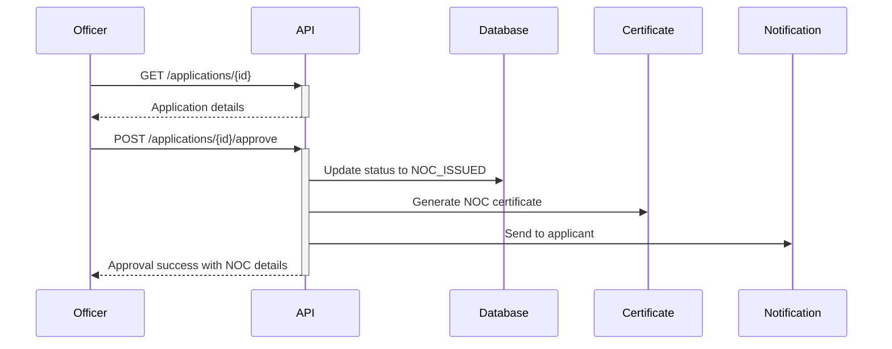

# SGWA Officer Portal - Complete API Reference
**State Groundwater Authority (SGWA) - API Documentation v1.0**

---

## 📋 Table of Contents

1. [Overview](#overview)
2. [Authentication](#authentication)
3. [Dashboard APIs](#dashboard-apis)
4. [Application Management](#application-management)
5. [Approval Workflow](#approval-workflow)
6. [Query Management](#query-management)
7. [Reports & Analytics](#reports--analytics)
8. [Document Management](#document-management)
9. [Notifications & Alerts](#notifications--alerts)
10. [Administration](#administration)
11. [Workflows & Use Cases](#workflows--use-cases)
12. [Testing Guide](#testing-guide)

---

## Overview

### Base URL
```
Production: https://sgwa.rajasthan.gov.in/api
Development: http://localhost:3000/api
```

### Authentication
All SGWA officer APIs require Bearer token authentication.

### HTTP Methods
- `GET` - Retrieve data
- `POST` - Create new resource
- `PUT` - Update existing resource
- `DELETE` - Remove resource

### Response Format
All responses follow a consistent JSON structure:

**Success:**
```json
{
  "success": true,
  "data": {...}
}
```

**Error:**
```json
{
  "success": false,
  "error": {
    "code": "ERROR_CODE",
    "message": "Human-readable message",
    "details": {}
  }
}
```

---

## Authentication

### 1. SGWA Officer Login

```http
POST /api/auth/login
Content-Type: application/json
```

**Request Body:**
```json
{
  "username": "sgwa.officer@rajasthan.gov.in",
  "password": "SecurePassword@123",
  "userType": "RSGWA",
  "captcha": "5A7K9"
}
```

**Success Response:**
```json
{
  "success": true,
  "data": {
    "token": "eyJhbGciOiJIUzI1NiIsInR5cCI6IkpXVCJ9...",
    "refreshToken": "refresh_token_here",
    "expiresIn": 3600,
    "user": {
      "id": "sgwa-officer-uuid",
      "username": "sgwa.officer@rajasthan.gov.in",
      "name": "Rajesh Kumar",
      "designation": "Chief Engineer",
      "department": "SGWA",
      "userType": "RSGWA",
      "permissions": [
        "VIEW_ALL_APPLICATIONS",
        "APPROVE_NOC",
        "REJECT_NOC",
        "ASSIGN_TO_DGO",
        "GENERATE_REPORTS",
        "MANAGE_OFFICERS",
        "CANCEL_NOC"
      ],
      "profilePicture": "/uploads/profile/sgwa-officer-uuid.jpg",
      "contactNumber": "+91-9876543210",
      "email": "sgwa.officer@rajasthan.gov.in"
    }
  }
}
```

**Error Response (401):**
```json
{
  "success": false,
  "error": {
    "code": "INVALID_CREDENTIALS",
    "message": "Invalid username or password"
  }
}
```

### 2. Refresh Token

```http
POST /api/auth/refresh
Authorization: Bearer {access_token}
Content-Type: application/json
```

**Request Body:**
```json
{
  "refreshToken": "refresh_token_here"
}
```

**Response:**
```json
{
  "success": true,
  "data": {
    "token": "new_access_token",
    "refreshToken": "new_refresh_token",
    "expiresIn": 3600
  }
}
```

### 3. Logout

```http
POST /api/auth/logout
Authorization: Bearer {access_token}
```

**Response:**
```json
{
  "success": true,
  "message": "Logged out successfully"
}
```

---

## Dashboard APIs

### 1. Get Dashboard Overview

```http
GET /api/officer/sgwa/dashboard
Authorization: Bearer {token}
```

**Response:**
```json
{
  "success": true,
  "data": {
    "stats": {
      "totalApplications": 1250,
      "pendingReview": 85,
      "pendingSgwaApproval": 45,
      "approvedThisMonth": 68,
      "rejectedThisMonth": 12,
      "activeNOCs": 980,
      "expiringNOCs": 35,
      "expiredNOCs": 15,
      "pendingPayments": 18,
      "underInspection": 22,
      "queriesRaised": 28
    },
    "trends": {
      "applicationsThisMonth": 95,
      "lastMonthComparison": "+12%",
      "approvalRate": "78%",
      "averageProcessingDays": 15
    },
    "districtWiseBreakdown": [
      {
        "district": "Jaipur",
        "pending": 25,
        "approved": 180,
        "rejected": 8
      },
      {
        "district": "Udaipur",
        "pending": 15,
        "approved": 120,
        "rejected": 5
      }
    ],
    "recentApplications": [
      {
        "id": "app-uuid-1",
        "applicationNumber": "NOC/RAJ/2026/00245",
        "applicantName": "Rajasthan Steel Industries Pvt. Ltd.",
        "projectName": "Steel Manufacturing Unit",
        "district": "Jaipur",
        "block": "Sanganer",
        "status": "PENDING_SGWA_APPROVAL",
        "submittedDate": "2026-01-10T10:30:00Z",
        "dgoRecommendation": "APPROVED",
        "dgoOfficer": "DGO Jaipur - Ramesh Sharma",
        "priority": "HIGH",
        "daysInQueue": 5,
        "waterRequirement": 150,
        "assignedOfficer": "Amit Verma"
      },
      {
        "id": "app-uuid-2",
        "applicationNumber": "NOC/RAJ/2026/00246",
        "applicantName": "Hotel Blue Diamond",
        "projectName": "5-Star Hotel Complex",
        "district": "Udaipur",
        "block": "Girwa",
        "status": "PENDING_SGWA_APPROVAL",
        "submittedDate": "2026-01-09T14:20:00Z",
        "dgoRecommendation": "CONDITIONAL_APPROVAL",
        "dgoOfficer": "DGO Udaipur - Priya Joshi",
        "priority": "MEDIUM",
        "daysInQueue": 6,
        "waterRequirement": 200,
        "assignedOfficer": null
      }
    ],
    "alerts": [
      {
        "id": "alert-1",
        "type": "URGENT",
        "severity": "HIGH",
        "message": "15 applications pending approval for more than 15 days",
        "count": 15,
        "actionRequired": true,
        "link": "/sgwa/applications?pending=15days"
      },
      {
        "id": "alert-2",
        "type": "EXPIRING",
        "severity": "MEDIUM",
        "message": "35 NOCs expiring within 30 days",
        "count": 35,
        "actionRequired": false,
        "link": "/sgwa/nocs?expiring=30days"
      },
      {
        "id": "alert-3",
        "type": "PAYMENT",
        "severity": "LOW",
        "message": "18 applications with pending payments",
        "count": 18,
        "actionRequired": false,
        "link": "/sgwa/payments/pending"
      }
    ],
    "upcomingTasks": [
      {
        "taskId": "task-1",
        "description": "Monthly compliance report generation",
        "dueDate": "2026-01-15",
        "priority": "HIGH",
        "assignedBy": "Secretary, SGWA"
      },
      {
        "taskId": "task-2",
        "description": "Review 10 high-priority applications",
        "dueDate": "2026-01-13",
        "priority": "URGENT"
      }
    ]
  }
}
```

### 2. Get Performance Metrics

```http
GET /api/officer/sgwa/metrics?period=monthly
Authorization: Bearer {token}
```

**Query Parameters:**
- `period` - daily, weekly, monthly, quarterly, yearly
- `fromDate` - Start date (ISO format)
- `toDate` - End date (ISO format)

**Response:**
```json
{
  "success": true,
  "data": {
    "period": "monthly",
    "dateRange": {
      "from": "2026-01-01",
      "to": "2026-01-31"
    },
    "metrics": {
      "totalApplicationsReceived": 95,
      "totalApproved": 68,
      "totalRejected": 12,
      "totalPending": 15,
      "averageProcessingTime": "14.5 days",
      "approvalRate": "78%",
      "rejectionRate": "12%",
      "queriesRaisedCount": 28,
      "resubmissionsCount": 8
    },
    "sectorWise": [
      {
        "sector": "Industry",
        "applications": 45,
        "approved": 35,
        "rejected": 5,
        "pending": 5
      },
      {
        "sector": "Domestic",
        "applications": 30,
        "approved": 25,
        "rejected": 2,
        "pending": 3
      },
      {
        "sector": "Agriculture",
        "applications": 20,
        "approved": 8,
        "rejected": 5,
        "pending": 7
      }
    ],
    "blockCategoryWise": {
      "safe": 40,
      "semiCritical": 35,
      "critical": 15,
      "overExploited": 5
    }
  }
}
```

---

## Application Management

### 1. Get All Applications (with Filters)

```http
GET /api/officer/sgwa/applications
Authorization: Bearer {token}
```

**Query Parameters:**
```
?status=PENDING_SGWA_APPROVAL
&district=Jaipur
&priority=HIGH
&dateFrom=2026-01-01
&dateTo=2026-01-31
&search=NOC/RAJ/2026
&page=1
&limit=20
&sortBy=submittedDate
&sortOrder=desc
```

**Available Filters:**
- `status` - Application status
  - `PENDING_SGWA_APPROVAL`
  - `APPROVED`
  - `REJECTED`
  - `UNDER_REVIEW`
  - `QUERY_RAISED`
  - `PENDING_PAYMENT`
  - `NOC_ISSUED`
- `district` - District name
- `block` - Block name
- `sector` - Water utilization sector
- `priority` - HIGH, MEDIUM, LOW
- `dgoRecommendation` - APPROVED, REJECTED, CONDITIONAL_APPROVAL
- `dateFrom`, `dateTo` - Date range
- `search` - Search by application number, applicant name, project name
- `assignedOfficer` - Officer ID or name
- `page`, `limit` - Pagination
- `sortBy` - Field to sort by
- `sortOrder` - asc or desc

**Response:**
```json
{
  "success": true,
  "data": {
    "applications": [
      {
        "id": "app-uuid-1",
        "applicationNumber": "NOC/RAJ/2026/00245",
        "trackingId": "REF-20260110-8765",
        "applicantDetails": {
          "name": "Rajasthan Steel Industries Pvt. Ltd.",
          "type": "COMPANY",
          "contactPerson": "Mr. Anil Sharma",
          "email": "anil@rajsteel.com",
          "phone": "+91-9876543210",
          "panNumber": "AAACR1234F",
          "gstNumber": "08AAACR1234F1Z5"
        },
        "projectDetails": {
          "projectName": "Steel Manufacturing Unit",
          "projectType": "NEW",
          "sector": "Industry",
          "industryType": "Heavy Industry - Steel",
          "investmentAmount": 5000000000,
          "employmentGeneration": 500
        },
        "locationDetails": {
          "state": "Rajasthan",
          "district": "Jaipur",
          "block": "Sanganer",
          "village": "Kukas",
          "plotNumber": "45/2",
          "khataNumber": "123",
          "khasraNumber": "456-458",
          "area": 50000,
          "areaUnit": "sq.meters",
          "coordinates": {
            "latitude": 26.8467,
            "longitude": 75.7873
          }
        },
        "waterRequirement": {
          "dailyRequirement": 150,
          "annualRequirement": 54750,
          "sourceType": "Borewell",
          "numberOfBorewells": 3,
          "depthOfBorewells": [150, 180, 200],
          "purpose": "Industrial process water"
        },
        "status": "PENDING_SGWA_APPROVAL",
        "currentStage": "SGWA_REVIEW",
        "priority": "HIGH",
        "submittedDate": "2026-01-10T10:30:00Z",
        "lastUpdated": "2026-01-11T15:45:00Z",
        "daysInQueue": 5,
        "workflow": {
          "dgoRecommendation": "APPROVED",
          "dgoOfficer": "Ramesh Sharma (DGO Jaipur)",
          "dgoRemarks": "Site inspection completed. All documents verified. Recommend approval with standard conditions.",
          "dgoApprovalDate": "2026-01-11T14:30:00Z",
          "inspectionReport": {
            "id": "inspection-uuid",
            "date": "2026-01-11",
            "officer": "Field Officer - Suresh Meena",
            "findings": "All details verified at site. Location matches application.",
            "photographs": ["photo1.jpg", "photo2.jpg"]
          }
        },
        "assignedOfficer": {
          "id": "officer-uuid",
          "name": "Amit Verma",
          "designation": "Executive Engineer"
        },
        "documents": [
          {
            "id": "doc-uuid-1",
            "type": "LAND_OWNERSHIP_PROOF",
            "fileName": "Land_Document.pdf",
            "uploadDate": "2026-01-10T10:35:00Z",
            "verified": true
          },
          {
            "id": "doc-uuid-2",
            "type": "ENVIRONMENTAL_CLEARANCE",
            "fileName": "EC_Certificate.pdf",
            "uploadDate": "2026-01-10T10:40:00Z",
            "verified": true
          }
        ],
        "timeline": [
          {
            "stage": "SUBMITTED",
            "date": "2026-01-10T10:30:00Z",
            "actor": "Applicant",
            "remarks": "Application submitted"
          },
          {
            "stage": "DGO_ASSIGNED",
            "date": "2026-01-10T11:00:00Z",
            "actor": "System",
            "remarks": "Auto-assigned to DGO Jaipur"
          },
          {
            "stage": "DGO_APPROVED",
            "date": "2026-01-11T14:30:00Z",
            "actor": "DGO Jaipur - Ramesh Sharma",
            "remarks": "Recommended for approval"
          },
          {
            "stage": "PENDING_SGWA_APPROVAL",
            "date": "2026-01-11T14:35:00Z",
            "actor": "System",
            "remarks": "Forwarded to SGWA for final approval"
          }
        ]
      }
    ],
    "pagination": {
      "currentPage": 1,
      "totalPages": 5,
      "totalItems": 85,
      "itemsPerPage": 20,
      "hasNextPage": true,
      "hasPreviousPage": false
    },
    "summary": {
      "totalApplications": 85,
      "highPriority": 15,
      "mediumPriority": 45,
      "lowPriority": 25,
      "avgProcessingTime": "12.5 days"
    }
  }
}
```

### 2. Get Single Application Details

```http
GET /api/officer/sgwa/applications/{applicationId}
Authorization: Bearer {token}
```

**Response:**
```json
{
  "success": true,
  "data": {
    "application": {
      // Full application details (same structure as above, but single object)
      "id": "app-uuid-1",
      "applicationNumber": "NOC/RAJ/2026/00245",
      // ... all fields as shown above
      
      // Additional detailed fields
      "hydrogeologicalData": {
        "aquiferType": "Hard Rock",
        "waterTableDepth": 45,
        "waterQuality": "Fresh Water",
        "tdsLevel": 450,
        "fluorideContent": 0.8,
        "nitrate Content": 25
      },
      "complianceChecklist": {
        "landOwnershipVerified": true,
        "environmentalClearance": true,
        "pollutionControlNOC": true,
        "districtPermission": true,
        "blockCategoryChecked": true,
        "waterRequirementValidated": true
      },
      "fees": {
        "applicationFee": 5000,
        "processingFee": 10000,
        "gwaCharge": 50000,
        "totalAmount": 65000,
        "paidAmount": 65000,
        "paymentStatus": "PAID",
        "paymentDate": "2026-01-10T11:00:00Z",
        "transactionId": "TXN20260110123456"
      }
    }
  }
}
```

---

## Approval Workflow

### 1. Approve Application and Issue NOC

```http
POST /api/officer/sgwa/applications/{applicationId}/approve
Authorization: Bearer {token}
Content-Type: application/json
```

**Request Body:**
```json
{
  "nocValidityYears": 3,
  "waterAllocationLimit": 150,
  "waterAllocationUnit": "m³/day",
  "conditions": [
    "Installation of certified water meter within 30 days of NOC issuance",
    "Submission of quarterly water consumption reports",
    "Annual compliance audit by empaneled consultant",
    "Maintain water abstraction within permitted limits",
    "Installation of rainwater harvesting structures as per norms",
    "No transfer or sublease of NOC without prior permission"
  ],
  "specialConditions": [
    "Deploy real-time monitoring system for water extraction",
    "Submit monthly digital meter readings through portal"
  ],
  "remarks": "Approved considering DGO recommendation and compliance with all statutory requirements. Project is in Safe zone as per latest assessment.",
  "attachments": ["sgwa-approval-letter-uuid", "technical-note-uuid"],
  "notifyApplicant": true,
  "generateCertificate": true
}
```

**Response:**
```json
{
  "success": true,
  "data": {
    "applicationId": "app-uuid-1",
    "applicationNumber": "NOC/RAJ/2026/00245",
    "status": "NOC_ISSUED",
    "noc": {
      "nocId": "noc-uuid-1",
      "nocNumber": "RJ/CGWA/NOC/2026/00245",
      "issueDate": "2026-01-12",
      "validFrom": "2026-01-12",
      "validUpto": "2029-01-11",
      "validityYears": 3,
      "waterAllocation": {
        "dailyLimit": 150,
        "annualLimit": 54750,
        "unit": "m³"
      },
      "certificateUrl": "/api/certificates/noc-uuid-1/download",
      "qrCode": "/api/certificates/noc-uuid-1/qr-code.png"
    },
    "approvalDetails": {
      "approvedBy": "Rajesh Kumar (Chief Engineer, SGWA)",
      "approvedOn": "2026-01-12T10:15:00Z",
      "approvalRemarks": "Approved as per request",
      "conditions": [...]
    },
    "notifications": {
      "emailSent": true,
      "smsSent": true,
      "portalNotification": true
    }
  }
}
```

**Error Response (400):**
```json
{
  "success": false,
  "error": {
    "code": "INVALID_STATUS_TRANSITION",
    "message": "Application cannot be approved in current status",
    "details": {
      "currentStatus": "UNDER_INSPECTION",
      "allowedActions": ["WAIT_FOR_INSPECTION"]
    }
  }
}
```

### 2. Reject Application

```http
POST /api/officer/sgwa/applications/{applicationId}/reject
Authorization: Bearer {token}
Content-Type: application/json
```

**Request Body:**
```json
{
  "rejectionReasons": [
    "INCOMPLETE_DOCUMENTATION",
    "LOCATED_IN_OVEREXPLOITED_BLOCK",
    "ENVIRONMENTAL_CLEARANCE_PENDING",
    "INADEQUATE_RAINFALL_HARVESTING_PROVISION"
  ],
  "primaryReason": "LOCATED_IN_OVEREXPLOITED_BLOCK",
  "detailedRemarks": "The project location falls under Over-exploited block (Sanganer). As per CGWA guidelines, new groundwater extraction in over-exploited areas requires exceptional approval from CGWA. Applicant is advised to explore alternate water sources or relocate the project.",
  "supportingDocuments": ["block-assessment-report-uuid", "cgwa-notification-uuid"],
  "allowResubmission": false,
  "suggestedActions": [
    "Obtain CGWA approval for extraction in over-exploited block",
    "Consider alternate water sources (surface water, recycled water)",
    "Explore project relocation to safe/semi-critical blocks"
  ],
  "notifyApplicant": true
}
```

**Response:**
```json
{
  "success": true,
  "data": {
    "applicationId": "app-uuid-1",
    "applicationNumber": "NOC/RAJ/2026/00245",
    "status": "REJECTED",
    "rejectionDetails": {
      "rejectedBy": "Rajesh Kumar (Chief Engineer, SGWA)",
      "rejectedOn": "2026-01-12T10:30:00Z",
      "reasons": [...],
      "canResubmit": false
    },
    "notifications": {
      "emailSent": true,
      "smsSent": true
    }
  }
}
```

### 3. Request Additional Information/Documents

```http
POST /api/officer/sgwa/applications/{applicationId}/query
Authorization: Bearer {token}
Content-Type: application/json
```

**Request Body:**
```json
{
  "queryType": "ADDITIONAL_DOCUMENTS",
  "subject": "Submission of Updated Environmental Clearance",
  "queryText": "Dear Applicant,\n\nYour environmental clearance certificate has expired. Please submit updated/renewed EC from State Environment Impact Assessment Authority (SEIAA) or Central Environment Impact Assessment Authority (CEIAA) as applicable.\n\nPlease ensure the EC covers the groundwater extraction component of your project.",
  "requiredDocuments": [
    {
      "documentType": "ENVIRONMENTAL_CLEARANCE",
      "description": "Updated EC from SEIAA/CEIAA",
      "mandatory": true
    },
    {
      "documentType": "NOC_POLLUTION_BOARD",
      "description": "NOC from Rajasthan State Pollution Control Board",
      "mandatory": true
    }
  ],
  "dueDate": "2026-01-25",
  "priority": "HIGH",
  "notifyApplicant": true,
  "enableAutoRejection": true,
  "autoRejectAfterDays": 30
}
```

**Response:**
```json
{
  "success": true,
  "data": {
    "queryId": "query-uuid-1",
    "applicationId": "app-uuid-1",
    "applicationNumber": "NOC/RAJ/2026/00245",
    "status": "QUERY_RAISED",
    "query": {
      "raisedBy": "Rajesh Kumar (SGWA)",
      "raisedOn": "2026-01-12T11:00:00Z",
      "dueDate": "2026-01-25",
      "subject": "Submission of Updated Environmental Clearance",
      "status": "PENDING_RESPONSE"
    },
    "notifications": {
      "emailSent": true,
      "smsSent": true,
      "portalNotification": true
    }
  }
}
```

### 4. Assign Application to Officer

```http
POST /api/officer/sgwa/applications/{applicationId}/assign
Authorization: Bearer {token}
Content-Type: application/json
```

**Request Body:**
```json
{
  "officerId": "officer-uuid-2",
  "remarks": "Assign for detailed technical review and site verification coordination",
  "priority": "HIGH",
  "dueDate": "2026-01-18",
  "notifyOfficer": true
}
```

**Response:**
```json
{
  "success": true,
  "data": {
    "applicationId": "app-uuid-1",
    "assignedTo": {
      "id": "officer-uuid-2",
      "name": "Priya Sharma",
      "designation": "Assistant Engineer"
    },
    "assignedBy": {
      "id": "current-officer-uuid",
      "name": "Rajesh Kumar",
      "designation": "Chief Engineer"
    },
    "assignedOn": "2026-01-12T11:30:00Z",
    "dueDate": "2026-01-18",
    "notificationSent": true
  }
}
```

### 5. Add Internal Notes/Comments

```http
POST /api/officer/sgwa/applications/{applicationId}/notes
Authorization: Bearer {token}
Content-Type: application/json
```

**Request Body:**
```json
{
  "noteText": "Discussed with DGO. Site is located near protected forest area. Need to verify if forest clearance is required.",
  "visibility": "INTERNAL_ONLY",
  "tagOfficers": ["officer-uuid-2", "officer-uuid-3"],
  "attachments": ["discussion-note-uuid"]
}
```

---

## Query Management

### 1. Get All Queries

```http
GET /api/officer/sgwa/queries?status=PENDING_RESPONSE
Authorization: Bearer {token}
```

**Response:**
```json
{
  "success": true,
  "data": {
    "queries": [
      {
        "queryId": "query-uuid-1",
        "applicationId": "app-uuid-1",
        "applicationNumber": "NOC/RAJ/2026/00245",
        "subject": "Submission of Updated Environmental Clearance",
        "raisedBy": "Rajesh Kumar",
        "raisedOn": "2026-01-12T11:00:00Z",
        "dueDate": "2026-01-25",
        "status": "PENDING_RESPONSE",
        "daysRemaining": 13,
        "priority": "HIGH"
      }
    ],
    "pagination": {...}
  }
}
```

### 2. View Query Details & Responses

```http
GET /api/officer/sgwa/queries/{queryId}
Authorization: Bearer {token}
```

**Response:**
```json
{
  "success": true,
  "data": {
    "query": {
      "queryId": "query-uuid-1",
      "applicationId": "app-uuid-1",
      "queryText": "...",
      "raisedOn": "2026-01-12T11:00:00Z",
      "status": "RESPONDED",
      "response": {
        "respondedBy": "Applicant - Anil Sharma",
        "respondedOn": "2026-01-15T14:30:00Z",
        "responseText": "Submitting renewed EC certificate as requested",
        "documents": [
          {
            "id": "doc-uuid-3",
            "type": "ENVIRONMENTAL_CLEARANCE",
            "fileName": "Updated_EC_2026.pdf"
          }
        ]
      }
    }
  }
}
```

### 3. Accept Query Response

```http
POST /api/officer/sgwa/queries/{queryId}/accept
Authorization: Bearer {token}
Content-Type: application/json
```

**Request Body:**
```json
{
  "remarks": "Documents verified. Proceeding with application review.",
  "moveToStatus": "UNDER_REVIEW"
}
```

### 4. Reject Query Response

```http
POST /api/officer/sgwa/queries/{queryId}/reject
Authorization: Bearer {token}
Content-Type: application/json
```

**Request Body:**
```json
{
  "rejectionReason": "Submitted EC does not cover groundwater extraction component",
  "raiseNewQuery": true,
  "newQueryText": "Please submit EC specifically mentioning groundwater extraction approval"
}
```

---

## Reports & Analytics

### 1. Generate Application Report

```http
POST /api/officer/sgwa/reports/generate
Authorization: Bearer {token}
Content-Type: application/json
```

**Request Body:**
```json
{
  "reportType": "APPLICATION_SUMMARY",
  "filters": {
    "dateFrom": "2026-01-01",
    "dateTo": "2026-01-31",
    "districts": ["Jaipur", "Udaipur", "Jodhpur"],
    "status": ["APPROVED", "REJECTED"],
    "sector": ["Industry", "Domestic"]
  },
  "groupBy": "district",
  "includeCharts": true,
  "format": "PDF",
  "emailTo": ["sgwa.officer@rajasthan.gov.in"]
}
```

**Available Report Types:**
- `APPLICATION_SUMMARY` - Overview of applications
- `APPROVAL_ANALYSIS` - Detailed approval statistics
- `DISTRICT_WISE` - District-wise breakdown
- `SECTOR_WISE` - Sector-wise analysis
- `BLOCK_CATEGORY_WISE` - By block classification
- `COMPLIANCE_REPORT` - Compliance status of NOC holders
- `REVENUE_REPORT` - Fee collection summary
- `PROCESSING_TIME` - Time analysis report

**Response:**
```json
{
  "success": true,
  "data": {
    "reportId": "report-uuid-1",
    "reportType": "APPLICATION_SUMMARY",
    "generatedOn": "2026-01-12T12:00:00Z",
    "generatedBy": "Rajesh Kumar",
    "downloadUrl": "/api/reports/report-uuid-1/download",
    "expiresOn": "2026-01-19T12:00:00Z",
    "emailSent": true
  }
}
```

### 2. Get Analytics Dashboard Data

```http
GET /api/officer/sgwa/analytics?period=monthly&type=comprehensive
Authorization: Bearer {token}
```

**Response:**
```json
{
  "success": true,
  "data": {
    "overview": {
      "totalApplications": 1250,
      "approvalRate": 78,
      "avgProcessingDays": 14.5,
      "revenueGenerated": 12500000
    },
    "trends": {
      "monthlyApplications": [85, 92, 78, 95],
      "monthlyApprovals": [65, 70, 60, 68],
      "months": ["Oct", "Nov", "Dec", "Jan"]
    },
    "districtWise": [...],
    "sectorWise": [...],
    "blockCategoryWise": {...}
  }
}
```

### 3. Export Data

```http
GET /api/officer/sgwa/export?type=applications&format=excel&filters=...
Authorization: Bearer {token}
```

---

## Document Management

### 1. Upload Document

```http
POST /api/officer/sgwa/documents/upload
Authorization: Bearer {token}
Content-Type: multipart/form-data
```

**Form Data:**
```
file: [binary file]
documentType: "APPROVAL_LETTER" | "TECHNICAL_NOTE" | "INSPECTION_REPORT"
relatedTo: "app-uuid-1"
description: "SGWA Approval Letter"
```

**Response:**
```json
{
  "success": true,
  "data": {
    "documentId": "doc-uuid-4",
    "fileName": "SGWA_Approval_Letter.pdf",
    "fileSize": 524288,
    "uploadedBy": "Rajesh Kumar",
    "uploadedOn": "2026-01-12T12:30:00Z",
    "downloadUrl": "/api/documents/doc-uuid-4/download"
  }
}
```

### 2. Download Document

```http
GET /api/officer/sgwa/documents/{documentId}/download
Authorization: Bearer {token}
```

### 3. View Document

```http
GET /api/officer/sgwa/documents/{documentId}/view
Authorization: Bearer {token}
```

Returns the document for inline viewing in browser.

---

## Notifications & Alerts

### 1. Get All Notifications

```http
GET /api/officer/sgwa/notifications?unreadOnly=true&page=1&limit=20
Authorization: Bearer {token}
```

**Response:**
```json
{
  "success": true,
  "data": {
    "notifications": [
      {
        "id": "notif-uuid-1",
        "type": "APPLICATION_ASSIGNED",
        "title": "New Application Assigned",
        "message": "Application NOC/RAJ/2026/00250 has been assigned to you",
        "priority": "HIGH",
        "read": false,
        "createdAt": "2026-01-12T13:00:00Z",
        "actionUrl": "/sgwa/applications/app-uuid-5"
      },
      {
        "id": "notif-uuid-2",
        "type": "QUERY_RESPONSE",
        "title": "Query Response Received",
        "message": "Applicant responded to query for NOC/RAJ/2026/00245",
        "priority": "MEDIUM",
        "read": false,
        "createdAt": "2026-01-12T12:45:00Z",
        "actionUrl": "/sgwa/queries/query-uuid-1"
      }
    ],
    "unreadCount": 15,
    "pagination": {...}
  }
}
```

### 2. Mark as Read

```http
PUT /api/officer/sgwa/notifications/{notificationId}/read
Authorization: Bearer {token}
```

### 3. Mark All as Read

```http
PUT /api/officer/sgwa/notifications/mark-all-read
Authorization: Bearer {token}
```

---

## Administration

### 1. Manage Officers

```http
GET /api/officer/sgwa/admin/officers
Authorization: Bearer {token}
```

**Response:**
```json
{
  "success": true,
  "data": {
    "officers": [
      {
        "id": "officer-uuid-1",
        "name": "Amit Verma",
        "designation": "Executive Engineer",
        "department": "SGWA",
        "email": "amit.verma@rajasthan.gov.in",
        "phone": "+91-9876543211",
        "status": "ACTIVE",
        "assignedApplications": 12,
        "permissions": [...]
      }
    ]
  }
}
```

### 2. Get Activity Logs

```http
GET /api/officer/sgwa/admin/activity-logs?officerId=officer-uuid-1&dateFrom=2026-01-01
Authorization: Bearer {token}
```

### 3. System Configuration

```http
GET /api/officer/sgwa/admin/config
PUT /api/officer/sgwa/admin/config
Authorization: Bearer {token}
```

---

## Workflows & Use Cases

### Use Case 1: Approve Application Flow



### Use Case 2: Handle Query Response

```
1. GET /queries?status=RESPONDED
2. GET /queries/{queryId}
3. Review submitted documents
4. POST /queries/{queryId}/accept
   OR
   POST /queries/{queryId}/reject
```

---

## Testing Guide

### PowerShell Complete Workflow

```powershell
# 1. Login as SGWA Officer
$loginBody = @{
    username = "sgwa.officer@rajasthan.gov.in"
    password = "SecurePass@123"
    userType = "RSGWA"
    captcha = "5A7K9"
} | ConvertTo-Json

$loginResponse = Invoke-RestMethod -Uri "http://localhost:3000/api/auth/login" `
    -Method POST `
    -Headers @{"Content-Type"="application/json"} `
    -Body $loginBody

$token = $loginResponse.data.token
Write-Host "Logged in successfully! Token: $token"

# 2. Get Dashboard
$headers = @{
    "Authorization" = "Bearer $token"
    "Content-Type" = "application/json"
}

$dashboard = Invoke-RestMethod -Uri "http://localhost:3000/api/officer/sgwa/dashboard" `
    -Method GET `
    -Headers $headers

Write-Host "Pending Applications: $($dashboard.data.stats.pendingSgwaApproval)"

# 3. Get Application List
$applications = Invoke-RestMethod -Uri "http://localhost:3000/api/officer/sgwa/applications?status=PENDING_SGWA_APPROVAL&limit=10" `
    -Method GET `
    -Headers $headers

$firstApp = $applications.data.applications[0]
Write-Host "First Application: $($firstApp.applicationNumber)"

# 4. Approve Application
$approvalBody = @{
    nocValidityYears = 3
    waterAllocationLimit = 150
    conditions = @(
        "Installation of water meter mandatory"
        "Quarterly compliance reports required"
    )
    remarks = "Approved with standard conditions"
    notifyApplicant = $true
    generateCertificate = $true
} | ConvertTo-Json

$approval = Invoke-RestMethod -Uri "http://localhost:3000/api/officer/sgwa/applications/$($firstApp.id)/approve" `
    -Method POST `
    -Headers $headers `
    -Body $approvalBody

Write-Host "NOC Issued: $($approval.data.noc.nocNumber)"
Write-Host "Valid Until: $($approval.data.noc.validUpto)"

# 5. Generate Report
$reportBody = @{
    reportType = "APPLICATION_SUMMARY"
    filters = @{
        dateFrom = "2026-01-01"
        dateTo = "2026-01-31"
    }
    format = "PDF"
} | ConvertTo-Json

$report = Invoke-RestMethod -Uri "http://localhost:3000/api/officer/sgwa/reports/generate" `
    -Method POST `
    -Headers $headers `
    -Body $reportBody

Write-Host "Report Generated: $($report.data.downloadUrl)"
```

---

## Error Codes Reference

| Code | HTTP Status | Description |
|------|-------------|-------------|
| `UNAUTHORIZED` | 401 | Invalid or expired token |
| `FORBIDDEN` | 403 | Insufficient permissions |
| `APPLICATION_NOT_FOUND` | 404 | Application ID not found |
| `INVALID_STATUS_TRANSITION` | 400 | Invalid workflow state change |
| `MISSING_REQUIRED_FIELDS` | 400 | Required fields not provided |
| `DUPLICATE_ACTION` | 409 | Action already performed |
| `VALIDATION_ERROR` | 400 | Input validation failed |
| `SERVER_ERROR` | 500 | Internal server error |

---

## Rate Limiting

- **Standard APIs:** 100 requests per minute
- **Report Generation:** 10 requests per minute
- **File Upload:** 20 requests per minute

---

## Security Best Practices

1. Always use HTTPS in production
2. Store tokens securely (never in localStorage for production)
3. Implement CSRF protection
4. Validate all input data
5. Log all critical actions
6. Implement proper session management
7. Use secure password hashing (bcrypt)
8. Enable 2FA for officer accounts

---

## Support & Contact

**Technical Support:** sgwa-tech@rajasthan.gov.in  
**API Documentation:** https://sgwa.rajasthan.gov.in/api-docs  
**Developer Portal:** https://developer.sgwa.rajasthan.gov.in  

---

**Version:** 1.0  
**Last Updated:** 2026-01-12  
**Maintained by:** SGWA Technical Team
